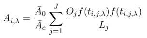

## Mapping Access to Employment in Canadian Cities

Code for measuring and visualizing access to employment in Canadian cities.

View the data on an interactive map [here](https://sausy-lab.github.io/canada-transit-access/map.html) :)

The raw data is [here](https://github.com/SAUSy-Lab/canada-transit-access/tree/gh-pages/data). A brief description is below, a more detailed description is in a [technical report](https://sausy-lab.github.io/canada-transit-access/data/canada-access-to-jobs-tech-report.pdf), slides from a couple recent presentations are [here](https://github.com/SAUSy-Lab/canada-transit-access/blob/master/slides)

This data has been used as the basis for a couple "academic" papers, one on comparing different types of accessibility measures, and the second on analyzing transport poverty in Canadian cities. Here's their citation info:

```
@article{allen2019ga,
  title = {A Measure of Competitive Access to Destinations for Comparing Across Multiple Study Regions},
  journal = {Geographical Analysis},
  author = {Allen, Jeff and Farber, Steven},
  doi = {10.1111/gean.12188},
  url = {https://onlinelibrary.wiley.com/doi/abs/10.1111/gean.12188},
}
```

```
@article{allen2019tp,
  title = {Sizing up transport poverty: A national scale accounting of low-income households suffering from inaccessibility in Canada, and what to do about it},
  journal = {Transport Policy},
  author={Allen, Jeff and Farber, Steven},
  volume = {74},
  pages = {214 - 223},
  year = {2019},
  issn = {0967-070X},
  doi = {https://doi.org/10.1016/j.tranpol.2018.11.018},
  url = {http://www.sciencedirect.com/science/article/pii/S0967070X18304736},
}
```


Any comments or questions, contact me at jeff.allen AT utoronto.ca.

-----------------------------

Measures of access to employment were generated based on the following formulation:


Ai is the accessibility measure for location i, Oj is the number of jobs at a location j, and t is the travel time from i to j. For the first three measures on the map, f(t) is simply a binary measure (0 or 1) of whether the travel time is greater or less than 30, 45, or 60 minutes respectively, in order to count the number of jobs reachable within these thresholds. For the accessibility index using a gravity model, f(t) is an inverse-decay function parameterized so that f(t) = 1 for t = 0, f(t) = 0.5 for t = 30 minutes, decaying to f(t) = 0 for t = 90 minutes.

The competitive measure accounts for the size of the labour force who are competing for jobs by discounting Oj by the labour force within its catchment area.


Lj is a measure of access to the labour force from j and Pi is the size of the labour force at i. This approach requires iteration until convergence. This is further expanded upon to account for a multi-modal labour force, ability to compare between regions, and any imbalance between the number of jobs and number of workers within a region. Lambda is a travel mode (e.g. car or transit) in the following.

  


Data for the location of jobs and the labour force are from Statistics Canada's 2016 census of population. The network graphs for measuring travel times from i to j were computed via OpenTripPlanner and OSRM using input data from OpenStreetMap and GTFS data from various transit agencies across Canada. The travel times for public transit and by car are for the morning commute period (for transit, this was computed for every minute from 7:00am to 9:00am and then averaged to account for fluctuating schedules). The overlay dot density layers are also from the 2016 census.

The code to generate the accessibility measures in this map are broken down into the following sub-folders.

**computing-travel-times** - For computing origin-destination matrices between home locations and potential work locations using OpenTripPlanner and OSRM

**computing-accessibility-metrics** - Code for inputting travel times and demographic and employment data from the Canadian census to generate measures of access to employment by travel mode.

**analysis-and-plots** - Various R scripts for tabulating, correlating, and visualizing the accessibility measures alongside demographic and socio-econmoic data.
